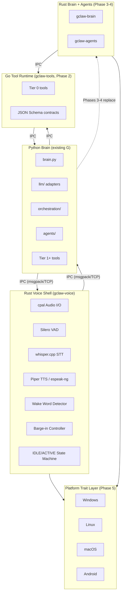
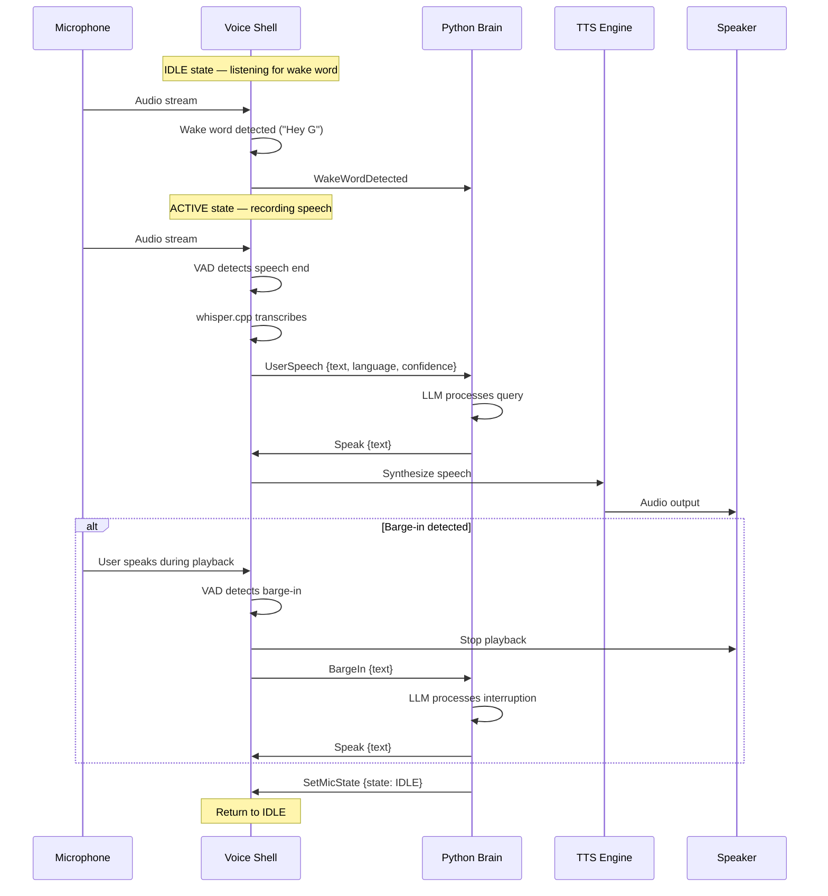
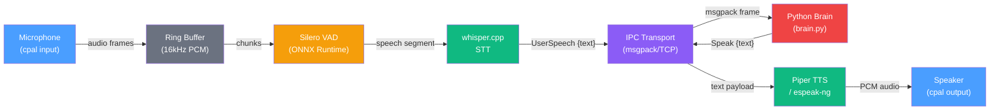

# G-Claw Architecture

## Overview

G-Claw is a portable, cross-platform rewrite of [G](../G/) — a 51K-line Python voice-first AI OS for Windows. G-Claw uses **Rust** (voice shell, brain, agents) and **Go** (tool runtime) for native performance and cross-platform deployment on RPi, Android, macOS, and embedded devices.

The migration is **incremental**: native components replace Python subsystems one at a time while the Python brain continues working via IPC.

## System Diagram

```
┌─────────────────────────────────────────────────────────────────┐
│                        G-CLAW SYSTEM                            │
│                                                                 │
│  ┌──────────────────┐  IPC (msgpack   ┌──────────────────────┐  │
│  │ Rust Voice Shell  │  over TCP/Unix  │ Python Brain         │  │
│  │ (gclaw-voice)     │ ◄────────────► │ (existing G)         │  │
│  │                   │  socket)        │                      │  │
│  │ • cpal audio I/O  │                 │ • brain.py + llm/    │  │
│  │ • Silero VAD      │                 │ • orchestration/     │  │
│  │ • whisper.cpp STT │                 │ • agents/            │  │
│  │ • Piper TTS       │                 │ • Tier 1+ tools      │  │
│  │ • Wake word       │                 └──────────┬───────────┘  │
│  │ • Barge-in        │                            │              │
│  └──────────────────┘               Phases 3-4 replace          │
│                                                   │              │
│  ┌──────────────────┐               ┌─────────────▼──────────┐  │
│  │ Go Tool Runtime   │  IPC          │ Rust Brain + Agents    │  │
│  │ (gclaw-tools)     │ ◄──────────► │ (gclaw-brain, Phase 3) │  │
│  │                   │               │ (gclaw-agents, Phase 4)│  │
│  │ • Tier 0 tools    │               └────────────────────────┘  │
│  │ • JSON Schema     │                                           │
│  │ • Contracts       │  ┌──────────────────────────────────────┐ │
│  └──────────────────┘  │ Platform Trait Layer (Phase 5)        │ │
│                         │ Windows │ Linux │ macOS │ Android     │ │
│                         └──────────────────────────────────────┘ │
└─────────────────────────────────────────────────────────────────┘
```

### Component Diagram (Mermaid)



### IPC Message Flow (Mermaid)



### Phase 1 Data Flow (Mermaid)



## Crate Structure

```
gclaw/
├── Cargo.toml                  # Workspace root
├── crates/
│   ├── gclaw-ipc/              # IPC protocol, codec, transport
│   │   └── src/
│   │       ├── protocol.rs     # Message types (shared across all components)
│   │       ├── codec.rs        # 4-byte length prefix + MessagePack framing
│   │       └── transport.rs    # TCP/Unix socket async I/O
│   │
│   ├── gclaw-config/           # Config loader with Fernet decryption
│   │   └── src/
│   │       └── config.rs       # Reads G's config.json, pure-Rust crypto
│   │
│   └── gclaw-voice/            # Native voice shell (Phase 1)
│       └── src/
│           ├── audio/
│           │   ├── capture.rs  # cpal mic input → ring buffer
│           │   └── playback.rs # cpal speaker output with stop flag
│           ├── vad/
│           │   └── silero.rs   # Silero VAD via ONNX Runtime
│           ├── stt/
│           │   └── whisper.rs  # whisper.cpp via whisper-rs
│           ├── tts/
│           │   ├── piper.rs    # Piper TTS (subprocess)
│           │   └── espeak.rs   # espeak-ng fallback (subprocess)
│           ├── wake/
│           │   └── detector.rs # Fuzzy wake word matching (strsim)
│           ├── bargein/
│           │   └── controller.rs # Concurrent TTS + VAD monitoring
│           ├── state.rs        # MicState, SessionMode, VoiceState
│           ├── shell.rs        # Main IDLE/ACTIVE state machine
│           ├── bridge.rs       # IPC server for Python brain connections
│           └── main.rs         # Binary entry point
│
├── python_bridge/
│   └── gclaw_bridge.py         # Drop-in replacement for speech.py calls
│
└── docs/
    ├── ARCHITECTURE.md         # This file
    ├── VOICE_PIPELINE.md       # Voice processing algorithm details
    └── IPC_PROTOCOL.md         # Wire protocol specification
```

## IPC Protocol

**Transport**: TCP on localhost (Windows) or Unix domain sockets (Linux/macOS).

**Framing**: `[4-byte big-endian length][MessagePack payload]`

**Ports**: Voice shell: 19820, Tool runtime: 19821

### Message Types

| Direction | Type | Payload |
|-----------|------|---------|
| Voice → Brain | `UserSpeech` | `{text, language, confidence}` |
| Voice → Brain | `WakeWordDetected` | (none) |
| Voice → Brain | `BargeIn` | `{text}` |
| Voice → Brain | `VoiceCommand` | `{command}` |
| Voice → Brain | `Ready` | (none) |
| Brain → Voice | `Speak` | `{text}` |
| Brain → Voice | `SpeakInterruptible` | `{text}` |
| Brain → Voice | `StopSpeaking` | (none) |
| Brain → Voice | `SetMicState` | `{state}` |
| Brain → Voice | `Configure` | `{stt_engine?, language?, ai_name?}` |
| Brain → Voice | `Shutdown` | (none) |
| Brain → Tools | `ToolExecute` | `{tool, args, user_input, mode}` |
| Tools → Brain | `ToolResult` | `{result, success, duration_ms, cache_hit, error?}` |
| Bidirectional | `Ping` / `Pong` | (none) |

## Phase Roadmap

| Phase | Component | Language | Status |
|-------|-----------|----------|--------|
| 1 | Voice Shell (`gclaw-voice`) | Rust | **In Progress** |
| 2 | Tool Runtime (`gclaw-tools`) | Go | Planned |
| 3 | LLM Adapter Layer (`gclaw-brain`) | Rust | Planned |
| 4 | Agent Swarm (`gclaw-agents`) | Rust | Planned |
| 5 | Platform Traits (`gclaw-platform`) | Rust | Planned |

## Build Targets

| Target | Arch | Command |
|--------|------|---------|
| Windows | x86_64 | `cargo build --release` |
| Linux Desktop | x86_64 | `cargo build --release --target x86_64-unknown-linux-gnu` |
| Raspberry Pi | aarch64 | `cross build --release --target aarch64-unknown-linux-gnu` |
| macOS (Apple Silicon) | aarch64 | `cargo build --release --target aarch64-apple-darwin` |
| Android | aarch64 | `cross build --release --target aarch64-linux-android` |

## Feature Flags

- `default` — Core library (IPC, config, audio, TTS, wake word). No native dependencies beyond cpal.
- `full` — Complete pipeline including whisper-rs (STT) and ort (VAD). **Requires LLVM/libclang** for whisper-rs bindgen.

Build with full features:
```bash
cargo build --release --features full
```

## Python Integration (Phase 1-2 Hybrid)

During the hybrid phase, the Python brain talks to gclaw-voice via IPC:

```python
# In assistant_loop.py, replace:
#   text = speech.listen()
#   speech.speak(response)
# With:
from gclaw_bridge import GclawVoiceBridge
bridge = GclawVoiceBridge(port=19820)
bridge.connect()
text, lang, conf = bridge.wait_for_speech()
bridge.speak(response)
```

The `gclaw_bridge.py` module provides drop-in function replacements that are API-compatible with the existing `speech.py` module.
